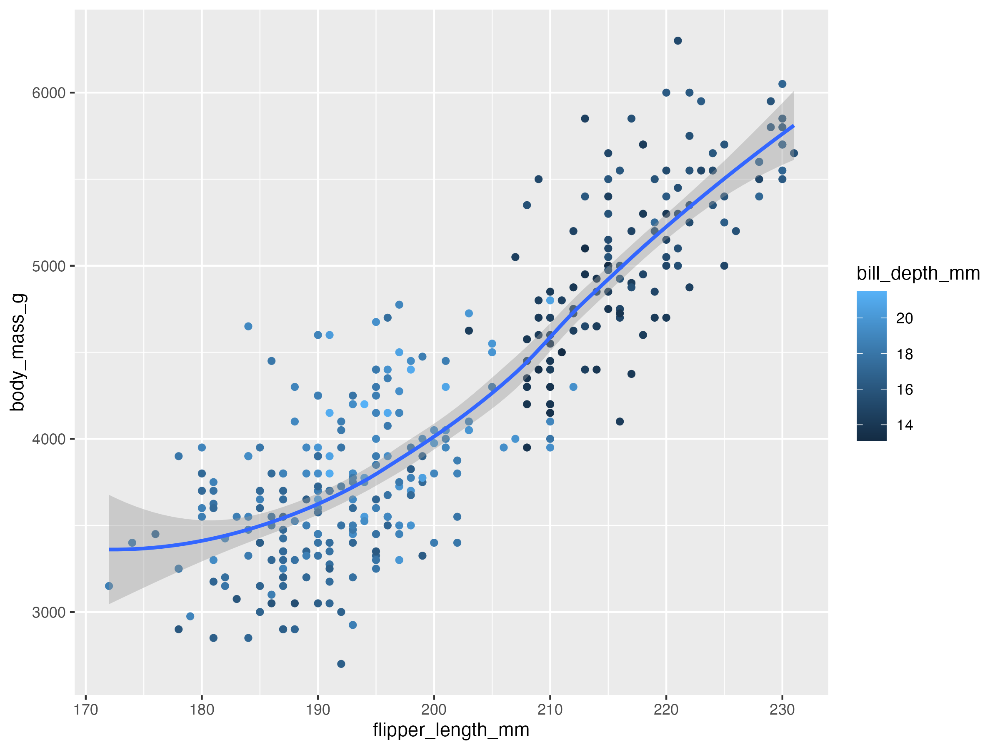

```{r setup, include=FALSE}
library(tidyverse)
library(palmerpenguins)
```

1. How many rows are in `penguins`? How many columns?

```{r}
dim(penguins)        # rows, columns
nrow(penguins)       # rows only
ncol(penguins)       # columns only
```

2. What does the `bill_depth_mm` variable describe?

**Answer:** It is the penguin bill (beak) depth, measured in millimeters.

3. Scatterplot of `bill_depth_mm` (y) vs `bill_length_mm` (x). Describe relationship.

```{r}
ggplot(penguins, aes(x = bill_length_mm, y = bill_depth_mm)) +
  geom_point(na.rm = TRUE)
```

**Answer:** Overall it trends upward (longer bills often have deeper bills), but it also looks like there are different groups (species) mixed together.

4. What happens if you make a scatterplot of `species` vs. `bill_depth_mm`? Better geom?

```{r}
ggplot(penguins, aes(x = species, y = bill_depth_mm)) +
  geom_point()
```

**Answer:** Points stack on top of each other because `species` is categorical. A better choice is a boxplot (or violin) with optional jitter:

```{r}
ggplot(penguins, aes(x = species, y = bill_depth_mm)) +
  geom_boxplot()
```

5. Why does this give an error and how to fix it?

```{r, eval=FALSE}
ggplot(data = penguins) + 
  geom_point()
```

**Answer:** `geom_point()` needs x and y mappings. Fix by adding `aes()`:

```{r}
ggplot(penguins, aes(x = bill_length_mm, y = bill_depth_mm)) +
  geom_point()
```

6. What does `na.rm` do in `geom_point()`? Default? Make a plot using `na.rm = TRUE`.

**Answer:** `na.rm` removes missing (NA) values instead of warning about them. Default is `FALSE`.

```{r}
ggplot(penguins, aes(x = bill_length_mm, y = bill_depth_mm)) +
  geom_point(na.rm = TRUE)
```

7. Add caption: “Data come from the palmerpenguins package.”

```{r}
ggplot(penguins, aes(x = bill_length_mm, y = bill_depth_mm)) +
  geom_point(na.rm = TRUE) +
  labs(caption = "Data come from the palmerpenguins package.")
```

8. Recreate the visualization. What aesthetic should `bill_depth_mm` map to? Global or geom?

```{r, echo=FALSE}

```

**Answer:** Map `bill_depth_mm` to **color**, and map it at the **geom level** (only points), so the smooth line stays one line.

```{r}
ggplot(penguins, aes(x = flipper_length_mm, y = body_mass_g)) +
  geom_point(aes(color = bill_depth_mm)) +
  geom_smooth()
```

9. Predict the output, then run and check.

```{r}
ggplot(
  data = penguins,
  mapping = aes(x = flipper_length_mm, y = body_mass_g, color = island)
) +
  geom_point() +
  geom_smooth(se = FALSE)
```

**Answer:** I expected points colored by island and separate smooth trend lines for each island, with **no** gray confidence band (because `se = FALSE`).

10. Will these two graphs look different? Why/why not?

```{r}
ggplot(
  data = penguins,
  mapping = aes(x = flipper_length_mm, y = body_mass_g)
) +
  geom_point() +
  geom_smooth()

ggplot() +
  geom_point(
    data = penguins,
    mapping = aes(x = flipper_length_mm, y = body_mass_g)
  ) +
  geom_smooth(
    data = penguins,
    mapping = aes(x = flipper_length_mm, y = body_mass_g)
  )
```

**Answer:** They look the same because both plots use the same data and the same x/y mappings. One sets them globally, the other sets them inside each geom.

11. Bar plot of `species` where `species` is on the y aesthetic. How is it different?

```{r}
ggplot(penguins, aes(y = species)) +
  geom_bar()
```

**Answer:** The bars are horizontal (same counts, just flipped direction).

12. How are the two plots different? Which is more useful for bars: `color` or `fill`?

```{r}
ggplot(penguins, aes(x = species)) +
  geom_bar(color = "red")

ggplot(penguins, aes(x = species)) +
  geom_bar(fill = "red")
```

**Answer:** `color` changes the outline only. `fill` changes the inside of the bars. For bar color, **fill** is usually more useful.

13. What does the `bins` argument in `geom_histogram()` do?

**Answer:** It controls how many bars (bins) the histogram uses (more bins = more detail, fewer bins = smoother look).

14. Histogram of `carat` in `diamonds`. Try binwidths. Which shows interesting patterns?

```{r}
ggplot(diamonds, aes(x = carat)) +
  geom_histogram(binwidth = 0.5)

ggplot(diamonds, aes(x = carat)) +
  geom_histogram(binwidth = 0.1)

ggplot(diamonds, aes(x = carat)) +
  geom_histogram(binwidth = 0.01)
```

**Answer:** `binwidth = 0.01` shows the most interesting patterns because you can see spikes around common carat sizes (like 0.5, 1.0, etc.).

15. Which `mpg` variables are categorical vs numerical? How can you see this?

```{r}
glimpse(mpg)
```

**Answer (categorical):** `manufacturer`, `model`, `trans`, `drv`, `fl`, `class`  
**Answer (numerical):** `displ`, `year`, `cyl`, `cty`, `hwy`  
You can see it in `glimpse(mpg)` (it shows the type: <chr>, <fct>, <dbl>, <int>).

16. Scatterplot of `hwy` vs `displ`. Map a third **numerical** variable to color, size, both, then shape. What happens?

```{r}
# color
ggplot(mpg, aes(x = displ, y = hwy, color = cty)) +
  geom_point()

# size
ggplot(mpg, aes(x = displ, y = hwy, size = cty)) +
  geom_point()

# color + size
ggplot(mpg, aes(x = displ, y = hwy, color = cty, size = cty)) +
  geom_point()
```

```{r, eval=FALSE}
# shape (this will error because shape needs a discrete variable)
ggplot(mpg, aes(x = displ, y = hwy, shape = cty)) +
  geom_point()
```

**Answer:** `color` and `size` work fine with numerical variables (continuous scales). `shape` does **not** work with numerical variables unless you turn it into a categorical variable (like `factor(cyl)`).

Example shape using a categorical version:

```{r}
ggplot(mpg, aes(x = displ, y = hwy, shape = factor(cyl))) +
  geom_point()
```

17. In the same plot, what happens if you map a third variable to `linewidth`?

```{r, eval=FALSE}
ggplot(mpg, aes(x = displ, y = hwy, linewidth = cty)) +
  geom_point()
```

**Answer:** Usually you get a warning because `geom_point()` doesn’t use `linewidth` the way line geoms do. For points, `stroke` controls border thickness (works best with shapes 21–25):

```{r}
ggplot(mpg, aes(x = displ, y = hwy, stroke = cty)) +
  geom_point(shape = 21, fill = "white", color = "black")
```

18. What happens if you map the same variable to multiple aesthetics?

**Answer:** It repeats the same info multiple ways (ex: color + shape). It can make groups easier to see, but it can also make the plot look too busy.

19. Scatterplot `bill_depth_mm` vs `bill_length_mm`, color by species. What does it reveal? What about faceting?

```{r}
ggplot(penguins, aes(x = bill_length_mm, y = bill_depth_mm, color = species)) +
  geom_point()

ggplot(penguins, aes(x = bill_length_mm, y = bill_depth_mm)) +
  geom_point() +
  facet_wrap(~ species)
```

**Answer:** Coloring shows the points form clear clusters by species. Faceting separates them so you can see the within-species patterns more clearly.

20. Why are there two legends? How to combine?

```{r, warning=FALSE}
ggplot(
  data = penguins,
  mapping = aes(
    x = bill_length_mm, y = bill_depth_mm, 
    color = species, shape = species
  )
) +
  geom_point() +
  labs(color = "Species")
```

**Answer:** There are two legends because color and shape have different legend titles. Combine by giving them the same title:

```{r}
ggplot(
  data = penguins,
  mapping = aes(
    x = bill_length_mm, y = bill_depth_mm, 
    color = species, shape = species
  )
) +
  geom_point() +
  labs(color = "Species", shape = "Species")
```

21. Stacked bar plots: what question can each answer?

```{r}
ggplot(penguins, aes(x = island, fill = species)) +
  geom_bar(position = "fill")

ggplot(penguins, aes(x = species, fill = island)) +
  geom_bar(position = "fill")
```

**Answer:**  
- First plot: “For each island, what *proportion* of penguins are each species?”  
- Second plot: “For each species, what *proportion* come from each island?”

22. Which plot is saved as `mpg-plot.png`? Why?

```{r, eval=FALSE}
ggplot(mpg, aes(x = class)) +
  geom_bar()
ggplot(mpg, aes(x = cty, y = hwy)) +
  geom_point()
ggsave("mpg-plot.png")
```

**Answer:** The second plot (cty vs hwy scatter) is saved because `ggsave()` saves the **last plot** that was created.

23. Save as PDF instead of PNG. How to find file types that work?

**Answer:** Change the filename to end in `.pdf`:

```{r, eval=FALSE}
ggsave("mpg-plot.pdf")
```

To find what file types work, check the help page: `?ggsave` (it shows the `device` and supported formats).
